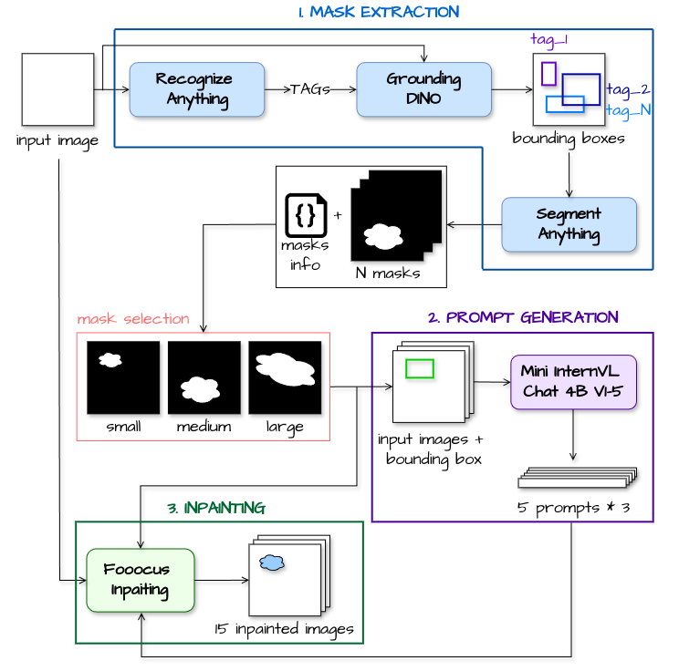

# Beyond-the-Brush
This repository contains the official code for the paper: "[Beyond-the-Brush: Fully-automated Crafting of Realistic Inpainted Images](https://ieeexplore.ieee.org/abstract/document/10810722)" presented at WIFS, 2024.

## Framework Overview

The Beyond the Brush (BtB) is a fully automated pipeline for generating realistic inpainted images. It consists of three main modules:
<ul>
    <li> <b>Mask Extraction</b>: identifies meaningful regions in an image to be inpainted using a segmentation procedure.
    <li> <b>Prompt Generation</b>: uses a Visual Language Model to determine the replacement content for the identified regions.
    <li> <b>Inpaiting</b>: inpaints the input images using the extracted masks and generated prompts.
</ul>




## Installation

**1. Clone the repository**
   ```bash
   git clone https://github.com/IAPP-Group/Beyond-the-Brush.git
   cd Beyond-the-Brush
   ```

  
**2. Set up the environment**
```bash
conda create -n btb python=3.8
conda activate btb
pip install -r requirements.txt
```

**3. Download Pre-trained Models**
Download the [RAM model weights](https://huggingface.co/spaces/xinyu1205/recognize-anything/blob/main/ram_swin_large_14m.pth) and place them in a directory.

## Usage

### 1. Mask Extraction
This module extracts meaningful regions for inpainting.

`python process_images.py --output_path --top_masks --ram_model_path --device input_list_path`

* `--output_path` specifies the directory to save the extracted masks (default: ./out)
* `--top_masks` is the number of top masks to extract per image (corresponding to the highest score)
* `--ram_model_path` is the path to the downloaded RAM model
* `--device` specifies the device to use for the extraction (cuda or cpu, default: cuda)
* `input_list_path` is the path to a text file containing a list of image paths to process.

The extracted data is saved in JSON and NPZ formats:
* JSON files store metadata and mask information.
* NPZ files contain the binary mask arrays

### 1.1 Postprocess Images
After extraction, post-process the masks for the next step.

`python post_processing.py --input_dir --num_images --dataset_name --save_dir_masks --save_dir_bb`

* `--input_dir` is the directory with .json and .npz files from mask extraction
* `--num_images` is the number of images to sample (default: None, which means all)
* `--dataset_name` is the name of the source dataset (e.g., Flickr30k, VISION, FloreView)
* `--save_dir_masks` is the directory to save masks as .png files
* `--save_dir_bb` is the directory to save the images with green bounding boxes

This script, will generate PNG masks for each input image of three different size (small, medium, and large), and PNG images with green bounding box for prompt generation.
Moreover, it will generate three txt files within the project directory:
<ul>
    <li> "best_mask_labels_<i>dataset_name</i>.txt": it contains the list of images with their labels and sizes. Specifically, each line in the file follows the format: ImageName_MaskAreaSize - Label
    <li> "sampled_<i>num_images</i>_images_<i>dataset_name</i>.txt": it contains the list of sampled json files from the input_dir
    <li> "source_images_path_<i>dataset_name</i>.txt": it contains the paths of the sampled source images.
</ul>

### 2. Prompt Generation
This module generates text prompts for the inpainting step using a Visual Language Model.

`python generate_prompts.py --output_dir --bounding_box_dir --labels_file --num_prompt`

* `--output_dir` is the directory to store generated prompts as .json files for each image
* `--bounding_box_dir` is the directory containing the images with the green bounding box
* `--labels_file` is the txt file containing the labels for each image produced in the postprocessing step
* `--num_prompt` is the number of prompts to generate for each image (default: 5)

### 3. Inpaiting
This module inpaints the images using Fooocus.

#### Setup

1. Install [Fooocus](https://github.com/lllyasviel/Fooocus) and [Fooocus-API](https://github.com/mrhan1993/Fooocus-API) by following their setup instructions.
2. Start the Fooocus-API app.

#### Inpaiting command

`python inpaint_images_fooocus.py --images_path --masks_path --prompt --save_path --fooocus_api_dir`

* `--images_path` is the txt file with the path of source images to be inpaint
* `--masks_path` is the directory containing the extracted masks
* `--prompt` is the directory containing the generated prompts
* `--save_path` is the directory to save the inpainted images
* `--fooocus_api_dir` is the path of Fooocus-API directory

⚠️ Note: ensure the HOST variable within the script matches the running Fooocus-API server.

### Dataset
The Beyond the Brush dataset used in the paper is available on [Hugging Face](https://huggingface.co/datasets/lesc-unifi/beyond-the-brush) 🤗. 

### Citation
Please, if you use this code cite out paper:
```
@inproceedings{bertazzini2024beyond,
  title={Beyond the Brush: Fully-automated Crafting of Realistic Inpainted Images},
  author={Bertazzini, Giulia and Albisani, Chiara and Baracchi, Daniele and Shullani, Dasara and Piva, Alessandro},
  booktitle={2024 IEEE International Workshop on Information Forensics and Security (WIFS)},
  pages={1--6},
  year={2024},
  organization={IEEE}
}
```
